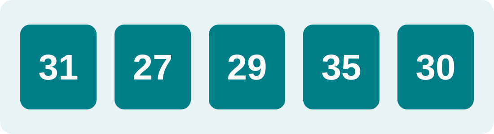
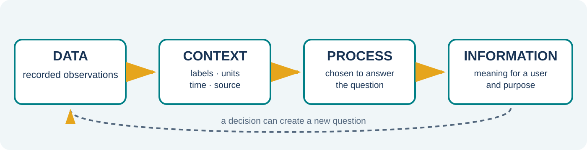
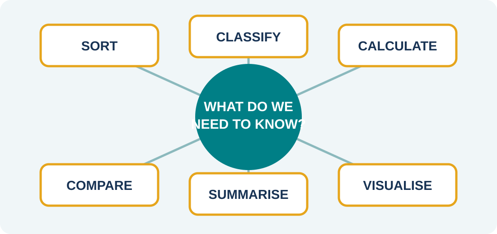
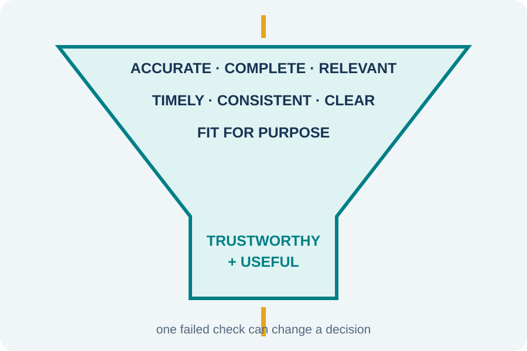
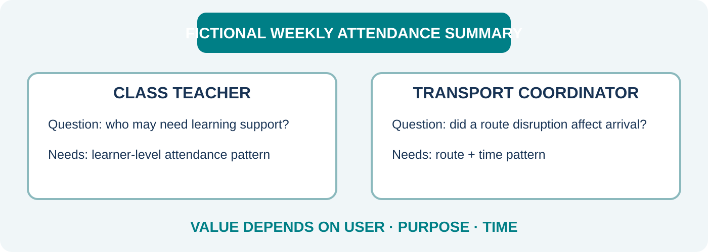
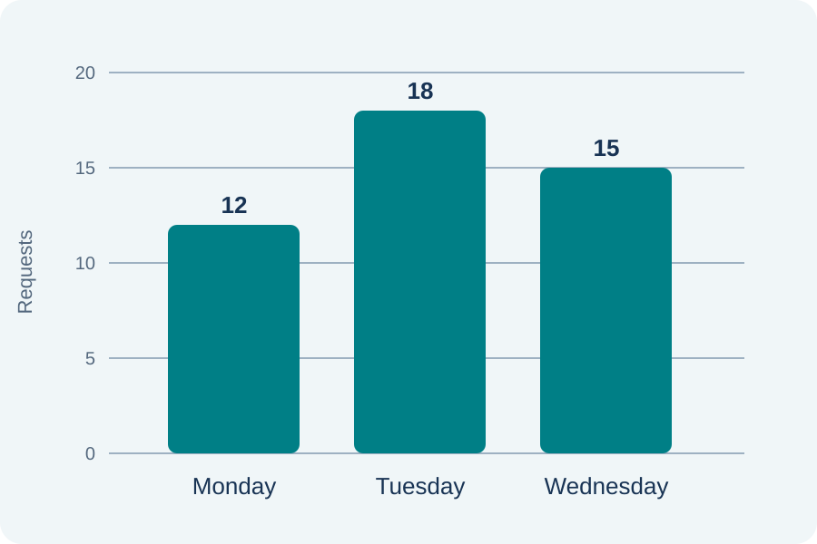
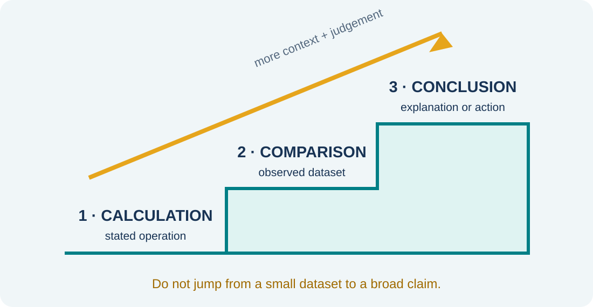
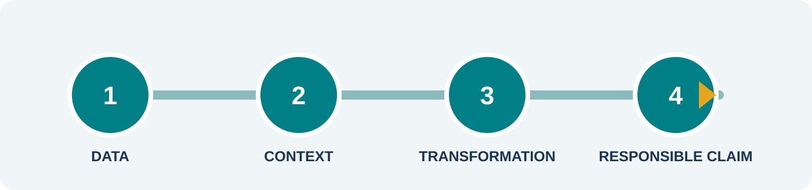

## Before the label {#notice-wonder}

::: {.visual-frame}
{.hero-visual fig-alt="Five unlabelled cards containing 31, 27, 29, 35 and 30."}
:::

::: {.fragment .prompt-card}
What do you **notice**? What do you **wonder**?
:::

Long description: five separate teal cards show the numbers 31, 27, 29, 35 and 30. No unit, date, source or subject is supplied, so their meaning cannot yet be determined.

::: {.notes}
Do not explain the numbers immediately. Give learners 20 seconds of silent looking, then ask pairs for one observation and one question. Accept claims about visible properties—such as “35 is largest”—but probe any invented context: “What evidence tells us these are marks or temperatures?” Reveal the prompt only after several responses. Say: “The values are recorded facts, but their meaning is underdetermined.” This establishes curiosity without demanding terminology first. Expected time: 4 minutes.
:::

## Add context, gain meaning {#context-changes-meaning}

::: {.columns}
::: {.column width="48%"}
### Same values

31 · 27 · 29 · 35 · 30
:::

::: {.column width="52%"}
::: {.fragment .context-card}
🌡️ Daily temperature (°C)
:::

::: {.fragment .context-card}
🧑‍💻 Unresolved support tickets
:::

::: {.fragment .context-card}
📝 Quiz scores out of 40
:::
:::
:::

::: {.fragment .takeaway}
**Context changes what we can responsibly conclude.**
:::

::: {.notes}
Reveal one context at a time. After each, ask: “What new statement is now defensible?” Invite precise language: for temperature, 35 °C is the highest recorded value; for tickets, day labels would still be needed to schedule staff; for quiz scores, the maximum alone does not identify mastery. Stress that context includes units, labels, time, source and purpose. Avoid saying raw data is useless; it may be useful once paired with the right question. Expected time: 5 minutes.
:::

## Data → information {#data-information-pipeline}

{.wide-visual fig-alt="Recorded observations gain context, are processed for a question, and become decision-supporting information."}

Long description: four connected stages run left to right. Data is described as recorded observations. Context adds labels, units, time and source. Processing includes sort, classify, calculate, compare, summarise and visualise. Information is a meaningful result for a user and purpose, leading to a decision. A feedback arrow shows that a decision may create a new question.

::: {.fragment .definition-grid}
::: {.definition-card}
**Data**  
Recorded observations or symbols
:::
::: {.definition-card}
**Information**  
Meaningful data for a user and purpose
:::
:::

::: {.notes}
Trace the diagram from left to right with one familiar example: attendance marks become an absence summary used by a class teacher. Ask learners to point out where meaning enters the process. Clarify that processing alone does not guarantee useful information; the operation must answer a question. Use “data are the recorded inputs; information is the meaningful output in context” as the retrieval phrase. Expected time: 6 minutes.
:::

## Choose the transformation {#transformations}

{.hero-visual fig-alt="Six transformations surround a question: sort, classify, calculate, compare, summarise and visualise."}

Long description: a central question is connected to six operations. Sort puts values in order; classify groups them; calculate derives a value; compare identifies similarity or difference; summarise reduces detail; visualise reveals patterns. The layout shows that the question determines the operation.

::: {.fragment .prompt-card}
Which operation would reveal a **trend over time**?
:::

::: {.notes}
Let learners first name operations they recognise. Point to each tile and request a one-phrase example. For the staged question, accept “visualise as a line chart” and “compare successive periods,” provided the learner justifies the choice. Ask why sorting alphabetically would not answer a trend question. Emphasise purposeful selection, not memorising a list. Expected time: 5 minutes.
:::

## A quality filter {#information-quality}

::: {.columns}
::: {.column width="59%"}
{.hero-visual fig-alt="A funnel applies seven quality checks before information is considered trustworthy and useful."}

Long description: data enters the top of a funnel. Seven quality checks narrow it: accuracy, completeness, relevance, timeliness, consistency, clarity and fitness for purpose. The output is labelled trustworthy and useful information. A warning notes that one failed check can change a decision.
:::

::: {.column width="41%"}
::: {.fragment .scenario-card}
The totals are correct…

but arrive **after** staffing is fixed.
:::

::: {.fragment .scenario-card}
Accurate?

**Yes.**
:::

::: {.fragment .scenario-card}
Valuable now?

**No—too late.**
:::
:::
:::

::: {.notes}
Ask learners to inspect the funnel before naming the criteria. Then use the staffing scenario to separate accuracy from value. Prompt: “Can information be correct but still poor for a decision?” Yes—if incomplete, irrelevant, late, unclear or otherwise unfit. Invite one counterexample from school life. Note that “fit for purpose” is an overall judgement grounded in the other checks and the decision context. Expected time: 7 minutes.
:::

## Useful to whom? {#value-by-user}

{.wide-visual fig-alt="The same fictional attendance summary supports different questions for a teacher and transport coordinator."}

Long description: the shared information product is a fictional weekly attendance summary. A class teacher asks which learners may need learning support and needs learner-level patterns. A transport coordinator asks whether a bus-route disruption affected arrival and needs route and time patterns. The final row says value depends on user, purpose and time.

::: {.fragment .takeaway}
Value = **user + purpose + timing**
:::

::: {.notes}
Explain that the example is fictional and contains no learner identities. Assign half the room the class-teacher role and half the transport-coordinator role. Ask each group what detail they need and what detail would be irrelevant or inappropriate. Use responses to surface data minimisation: a user should receive the detail required for their legitimate purpose, not every available field. Expected time: 6 minutes.
:::

## Worked example: read the chart {#worked-example}

::: {.columns}
::: {.column width="58%"}
{.hero-visual fig-alt="Bar chart: Monday 12, Tuesday 18 and Wednesday 15 fictional help-desk requests; Tuesday is highest."}

Long description: a vertical bar chart shows fictional help-desk request counts. Monday has 12, Tuesday 18 and Wednesday 15 requests. The y-axis runs from zero to twenty. Tuesday's bar is the tallest.
:::

::: {.column width="42%"}
::: {.fragment .step-card}
**1 · Calculate**  
Total = 12 + 18 + 15 = **45**  
Mean = 45 ÷ 3 = **15**
:::

::: {.fragment .step-card}
**2 · Compare**  
Tuesday recorded the **highest count**.
:::

::: {.fragment .step-card}
**3 · Conclude—with context**  
Investigate why Tuesday was higher **before changing staffing**.
:::
:::
:::

::: {.notes}
Reveal the three stages separately and insist on their different evidence status. Calculations are derived numerically: total 45 and mean 15. “Tuesday recorded the highest count” is a comparison result directly supported by this three-day dataset. The final statement is a cautious contextual conclusion or action: investigate first. Do not claim Tuesday generally has the “highest demand”; three observations do not establish a recurring demand pattern, cause or future staffing need. Ask: “What additional weeks and contextual facts would strengthen that decision?” Expected time: 8 minutes.
:::

## Evidence ladder {#evidence-ladder}

{.hero-visual fig-alt="Three steps progress from calculation to comparison result to contextual conclusion."}

Long description: the first stair is Calculation—derived using a stated operation. The second is Comparison result—describes the observed dataset. The third is Contextual conclusion—connects evidence to an explanation or action. An upward arrow says context and judgement increase; an alert says do not jump from one small dataset to a broad claim.

::: {.fragment .prompt-card}
“Tuesday is always busiest.” Which step is missing?
:::

::: {.notes}
Use this as a hinge question. Learners should identify that “always” is an unsupported broad contextual conclusion: multiple comparable weeks are missing, and factors such as outages or reporting changes have not been considered. Ask learners to rewrite it safely: “Tuesday had the highest recorded count in this three-day dataset.” Check for the words recorded and this dataset. Expected time: 4 minutes.
:::

## Quality detective {#quality-detective}

::: {.scenario-banner}
“The library report says **120 loans** this week.”
:::

::: {.fragment .clue-grid}
::: {.clue-card}
📅 Generated last term
:::
::: {.clue-card}
📚 E-books omitted
:::
::: {.clue-card}
🔁 One day counted twice
:::
::: {.clue-card}
🎯 Used to order next week’s books
:::
:::

::: {.fragment .prompt-card}
Name the failed quality checks. Which failure matters most?
:::

::: {.notes}
Reveal clues one by one and ask learners to diagnose them: last term fails timeliness and relevance to next week; omitted e-books fails completeness; double counting fails accuracy and consistency. The final question has no context-free single answer. Learners must relate severity to the ordering decision and explain how a failure might change it. Ask pairs to repair the information product in one sentence. Expected time: 6 minutes.
:::

## Exit ticket: claim with care {#exit-ticket}

{.wide-visual fig-alt="Four checkpoints lead from data through context and transformation to a responsible claim."}

Long description: a route moves through four checkpoints. First identify the recorded data; second state labels, units, time and source; third select an operation that answers the question; fourth make a claim no broader than the evidence. It ends at an exit-ticket icon.

::: {.fragment .exit-prompt}
Give one example of information that is **accurate** but has **low value** because it is irrelevant or late.

Name the **user, purpose, and missing quality**.
:::

::: {.notes}
Give learners one quiet minute to write. A complete response identifies an accurate information item, a specific user and decision, and why irrelevance or lateness removes value. Example: last month’s accurate canteen stock count is too late for today’s order. Collect responses or sample three anonymously. Close by returning to the opening values: data becomes information when context and purposeful processing support a responsible claim. Expected time: 5 minutes.
:::
