## A small task becomes a big task {#scale-hook}

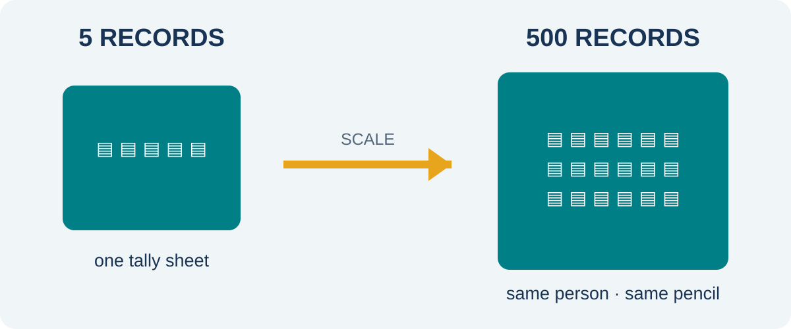{.hero-visual fig-alt="A fictional stack of request cards grows from five cards to five hundred, while one person still has only one pencil and tally sheet."}

Long description: on the left, one person comfortably processes five fictional request cards. On the right, the same person faces five hundred cards. A scale arrow points from small to bulk, prompting consideration of elapsed time, repetition and checking.

::: {.fragment .prompt-card}
What changes when **5 records become 500**?
:::

::: {.notes}
Give learners 20 seconds to inspect the image before revealing the question. Gather observable consequences, not slogans: more elapsed time, repeated actions, harder checking, greater storage and retrieval effort, and more opportunities for transcription inconsistency. Do not imply that manual work is always poor. Ask: “At what scale would your confidence or time limit change?” Expected time: 4 minutes.
:::

## Trace the manual workflow {#manual-workflow}

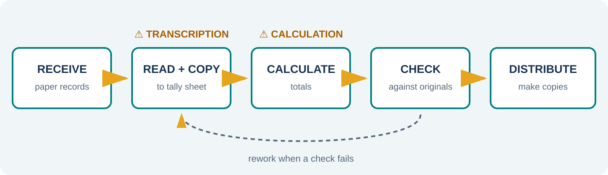{.wide-visual fig-alt="A five-stage manual workflow: receive paper records, read, copy to tally sheet, calculate totals and distribute copies. Warning symbols mark transcription and calculation points."}

Long description: fictional paper requests move through five hand-operated stages. The read-to-copy boundary is marked as a transcription risk and the total stage as a calculation risk. A return arrow from checking to copying shows rework.

::: {.fragment .takeaway}
More steps can mean more **time, variation, and rework**.
:::

::: {.notes}
Walk the class through the diagram using the practical’s fictional request records. Ask learners where a value is copied, transformed or checked. Reliability means the process operates dependably; accuracy means closeness to the correct value. A careful manual workflow may be accurate, while an automated workflow can repeat a faulty rule. Expected time: 6 minutes.
:::

## Compare with evidence {#workflow-comparison}

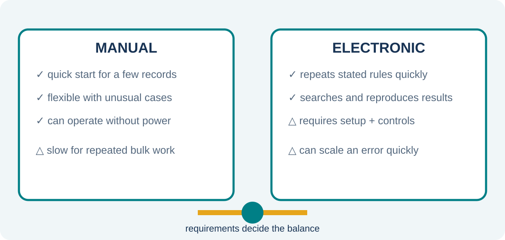{.hero-visual fig-alt="A balanced comparison of manual and electronic workflows across scale, setup, repetition, checking, storage and failure impact. Neither side is labelled universally better."}

Long description: manual work is shown as quick to start for a few records, flexible for unusual cases and operable without power, but slow for repeated bulk work. Electronic work requires setup and controls, then can repeat rules, search records and reproduce results quickly. A warning states that errors may also be reproduced at scale.

::: {.fragment .prompt-card}
Which method fits **20 one-off cards**? What about **20,000 repeated records**?
:::

::: {.notes}
Invite two different defensible recommendations. Require learners to state task volume, repetition, required speed, checking needs and available resources. Challenge “digital is always better” by introducing setup cost, power, training or an unusual one-off case. Challenge “manual is safer” by increasing volume and deadline pressure. The criterion is fitness for purpose supported by evidence. Expected time: 7 minutes.
:::

## Technology reshapes the flow {#electronic-workflow}

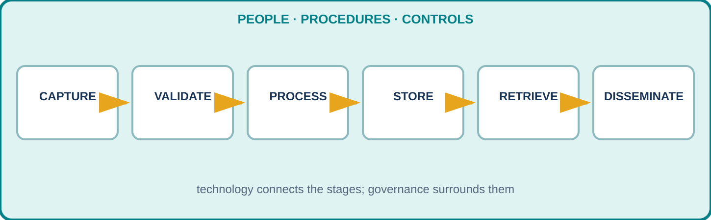{.wide-visual fig-alt="An electronic information workflow connects capture, validation, processing, storage, retrieval and dissemination, with people and controls surrounding every stage."}

Long description: six connected stages run left to right. Automation symbols appear at repeated processing, storage and distribution. A surrounding frame labelled people, procedures and controls shows that technology is one part of the information system.

::: {.fragment .takeaway}
Automate the repetition—**keep human judgement and controls**.
:::

::: {.notes}
Trace a fictional stock report through the stages. Electronic technology can capture, reproduce calculations, store, retrieve and disseminate information rapidly. Pause at validation: this lesson treats controls conceptually; detailed validation and processing modes belong to Competency 1.5. Ask where a person must define rules, investigate exceptions and authorise a decision. Expected time: 6 minutes.
:::

## Fast error is still error {#automation-risk}

::: {.columns}
::: {.column width="58%"}
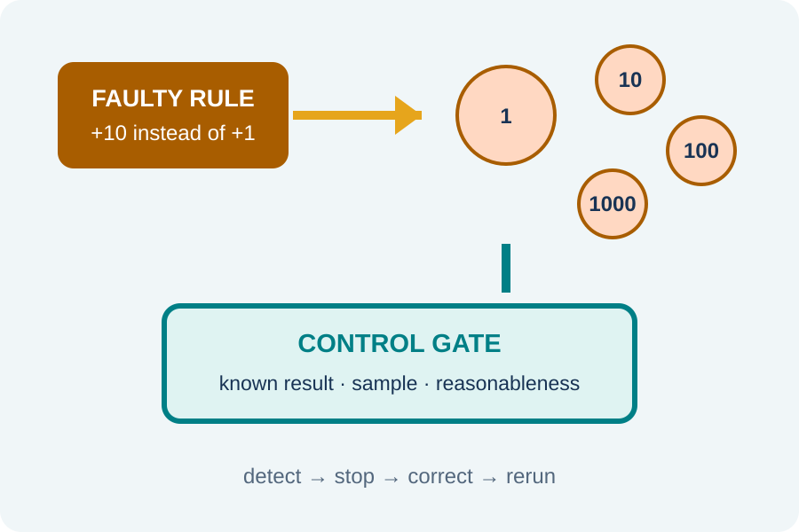{.hero-visual fig-alt="A faulty rule adds ten instead of one to each fictional record, producing a widening stream of incorrect outputs. A control gate stops the stream after a sample check."}

Long description: a single wrong processing rule enters an automated pipeline. One bad result becomes ten and then one thousand bad results. A sample check and reasonableness test form a control gate that detects and stops the fault.
:::

::: {.column width="42%"}
::: {.fragment .scenario-card}
Rule intended: **+1**
:::

::: {.fragment .scenario-card}
Rule entered: **+10**
:::

::: {.fragment .scenario-card}
Faster output ≠ accurate output
:::
:::
:::

::: {.notes}
Reveal the intended and entered rules separately. Ask whether the computer is operating reliably; it may be reliably executing the wrong instruction. Then ask which controls could detect the fault: test data with known results, sampling, range or reasonableness checks, reconciliation and human review. Emphasise that automation changes the speed and scale of both correct work and errors. Expected time: 5 minutes.
:::

## A connected information world {#ict-convergence}

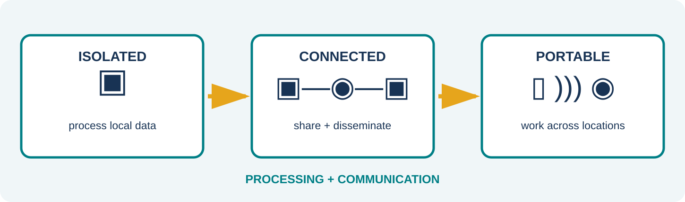{.wide-visual fig-alt="A progression from isolated electronic processing, through connected networks, to portable networked devices that create, manage and share information across locations."}

Long description: three scenes show an isolated computer processing local data, several computers sharing information over a network, and portable devices communicating across locations. The progression is conceptual rather than a dated historical timeline.

::: {.fragment .takeaway}
Processing + communication enables information to move.
:::

::: {.notes}
Use the diagram as a conceptual sequence, not a date-memorisation exercise. Ask what becomes possible at each transition: repeated electronic processing, shared access and dissemination, then work across locations. Also ask what new dependencies appear: networks, security, identity, power and compatible procedures. Link this convergence to the term ICT. Expected time: 5 minutes.
:::

## Information moves through daily life {#daily-life-dissemination}

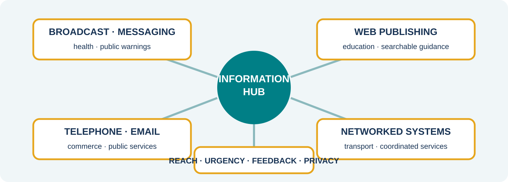{.wide-visual fig-alt="A fictional community information hub disseminates information through broadcast, telephone, messaging, email and the Web to education, health, transport, commerce and public-service domains."}

Long description: a central information hub connects to five dissemination methods—broadcast, telephone, messaging, email and Web publishing. These reach five daily-life domains: education, health, transport, commerce and public services. Two-way arrows show that some channels also return new data and feedback.

::: {.fragment .prompt-card}
Which channel fits an **urgent warning**? Which fits a **searchable guide**?
:::

::: {.notes}
Ask learners first to name information technologies they use in daily life, then connect them to a purpose and audience. An urgent warning might use broadcast or messaging for reach and immediacy; a searchable guide may use the Web. Email or telephone may suit a defined recipient. Stress that the technology choice depends on accessibility, urgency, reach, feedback, privacy and the need for a durable record. The displayed domains are examples, not exhaustive categories. Expected time: 6 minutes.
:::

## Internet ≠ World Wide Web {#internet-versus-web}

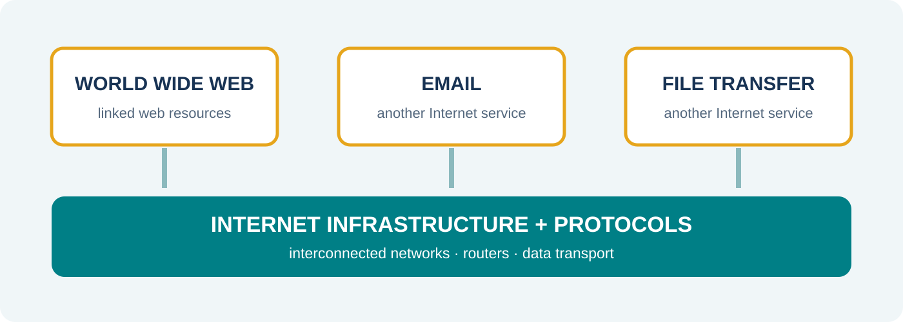{.wide-visual fig-alt="A layered diagram places the World Wide Web, email and file transfer as separate services above shared Internet network infrastructure and protocols."}

Long description: the lower layer contains interconnected networks, routers and Internet protocols. Three service boxes sit above it: World Wide Web, email and file transfer. The Web is one service that uses the Internet, not the entire Internet.

::: {.fragment .prompt-card}
If a webpage is unavailable, is the **Internet necessarily down**?
:::

::: {.notes}
Point first to the infrastructure layer: interconnected networks and protocols carry data. Then identify the Web as linked resources accessed through web technologies over that infrastructure. Email and file transfer also use Internet infrastructure without being the Web. For the hinge question, answer no: one site, web service or browser path may fail while other Internet services remain available. Avoid overloading learners with protocol detail here. Expected time: 7 minutes.
:::

## Sort the services {#service-sort}

::: {.sort-grid}
::: {.sort-card .fragment}
🌐 Open a linked webpage
:::
::: {.sort-card .fragment}
✉️ Send an email
:::
::: {.sort-card .fragment}
📁 Transfer a file
:::
::: {.sort-card .fragment}
📡 Route data between networks
:::
:::

::: {.fragment .category-strip}
**Web service** · **Other Internet service** · **Infrastructure**
:::

::: {.notes}
Reveal each card and ask learners to hold up one, two or three fingers for Web service, another Internet service or infrastructure. Answers: linked webpage—Web; email—other Internet service; file transfer—other Internet service; routing—Internet infrastructure. Ask one learner to justify each classification using the layered diagram. Expected time: 4 minutes.
:::

## Mobile fieldwork: benefit and constraint {#mobile-fieldwork}

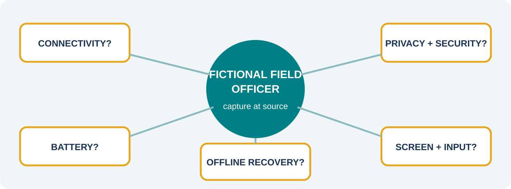{.wide-visual fig-alt="A fictional field officer records a damaged road sign on a tablet; a decision map branches through connectivity, battery, privacy, screen and offline recovery checks."}

Long description: a fictional field officer can capture a photo, location and condition at the work site. Five checks surround the task: connectivity, battery, privacy and security, screen and input limitations, and offline recovery. The final recommendation is to save locally and synchronise securely when connected.

::: {.fragment .three-part}
::: {.mini-card}
**Benefit**  
Capture at source
:::
::: {.mini-card}
**Limitation**  
Signal may fail
:::
::: {.mini-card}
**Control**  
Offline save + secure sync
:::
:::

::: {.notes}
State that the officer and records are fictional. Ask learners to identify the information task before judging the device. Reveal benefit, limitation and control in order. Extend the evaluation: battery reserve, device authentication, minimum necessary personal data, readable forms and recovery after interrupted synchronisation. Mobile computing means portable processing and communication; it is not limited to phones. Expected time: 7 minutes.
:::

## Communicate, compute, connect to cloud {#mobile-communication-computing-cloud}

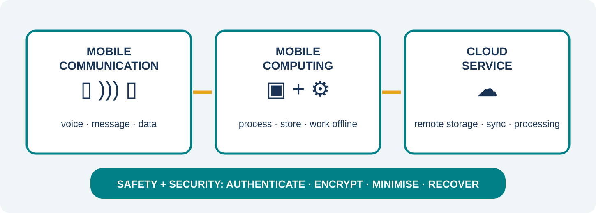{.wide-visual fig-alt="A layered mobile-work diagram separates communication, on-device computing and optional cloud services, with a safety and security shield spanning all layers."}

Long description: the first layer, mobile communication, exchanges voice, messages or data across a wireless network. The second, mobile computing, processes and stores information on a portable device and may work offline. The third, cloud service, provides remote storage, processing or synchronisation over a network. A shield across all layers lists authentication, encryption, minimum data and recovery.

::: {.fragment .three-part}
::: {.mini-card}
**Communicate**  
Exchange across distance
:::
::: {.mini-card}
**Compute**  
Process on a portable device
:::
::: {.mini-card}
**Cloud**  
Remote service via a network
:::
:::

::: {.notes}
Build the distinction from the fieldwork example. A voice call is mobile communication but may involve little information processing by the user. Completing and validating a form on a tablet is mobile computing, even while offline. Synchronising the form to a remotely hosted service uses a network-accessed cloud service. Cloud is not a synonym for the Internet; it is a way of providing remote computing resources over networks. Ask what happens when connectivity disappears and what must remain protected. Expected time: 7 minutes.
:::

## Recommend, do not advertise {#decision-rule}

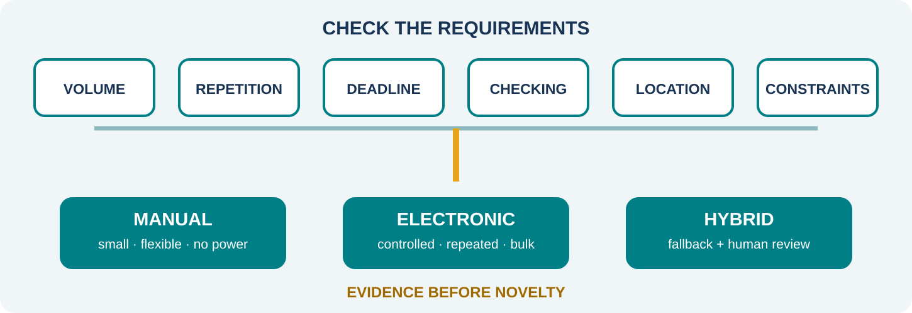{.wide-visual fig-alt="A decision route asks about volume, repetition, deadline, checking, location and constraints before choosing manual, electronic or hybrid workflow."}

Long description: six requirement checkpoints lead to three possible destinations. A manual workflow suits small, flexible, power-independent tasks; an electronic workflow suits controlled repeated bulk work; a hybrid workflow combines paper fallback or human review with electronic processing. The route says evidence before novelty.

::: {.fragment .exit-prompt}
Name one task where a **manual or hybrid** method remains appropriate.

Justify it with **two requirements**.
:::

::: {.notes}
Give one quiet minute for an individual response. Accept examples such as a short emergency checklist during a power outage or paper capture with later controlled entry, provided the justification names requirements rather than preference. A strong answer compares at least two of scale, speed, reliability, accuracy, checking, cost, location, connectivity or recovery. Close with: “Choose from evidence and requirements—not novelty.” Expected time: 5 minutes.
:::
